# **PAO Metal Mining**

**PAO Metal Mining** is a project dedicated to large-scale analysis of metal music lyrics.

The objective is to examine vocabulary, themes, emotions, and stylistic evolutions of metal through a sufficiently large and representative corpus of songs.

The project follows an exploratory approach: understanding what lyrics reveal about the genre, how they vary according to groups or eras, and what trends appear when applying textual analysis methods.

The entire work is based on setting up a complete pipeline from text collection to the production of visualizations and linguistic indicators.

# **I Data Collection (Scraping)**

The first step of the project consisted of building a dataset of metal song lyrics. Two data sources were used: **DarkLyrics** for lyrics and **Metal Archives** for genre metadata.

**1. Lyrics Scraping via DarkLyrics**

The main scraping relies on the Python library `metalparser`, which allows automated querying of the DarkLyrics website.

The `scraper.py` script implements a **distributed scraping** system allowing multiple users to work in parallel on different portions of the dataset:

- The complete artist list is divided into **4 quarters**, each assigned to a different user.
- Each user runs the script with their name (`-user Florent`, `-user Nizar`, etc.) and only processes their assigned portion.
- A **progressive saving** system records the progress state after each processed artist, allowing scraping to resume in case of interruption.

For each artist, the script retrieves:

- lyrics of each song,
- titles,
- albums,
- release years,
- publication type (album, EP, demo),
- track number.

Individual progress files (`progress1.json`, `progress2.json`, etc.) are then merged via `merge_progress_files.py` to create the final `dataset.json` file.

**2. Genre Scraping via Metal Archives**

To enrich the dataset with musical genres for each band, a second script (`metallum_webscraper.py`) queries the **Metal Archives** (Encyclopaedia Metallum) website.

This scraping uses **Selenium** with an automated Chrome browser to bypass the site's anti-bot protections:

- The script applies **stealth** techniques (masking `webdriver` properties, custom user-agent, etc.).
- For each band, it accesses its dedicated page and extracts the genre from the `#band_stats` section.
- A configurable delay between requests allows respecting server limits.

Retrieved genres are saved in `data/bands_genres.json`, then cleaned via `clean_genres.py` to produce `bands_genres_cleaned.json`.

**3. Data Merging and Enrichment**

Progress files are merged via `merge_progress_files.py`, which also adds **automatic language detection** for each song (via the `langdetect` library).

The final dataset (`data/dataset.json`) contains for each song:

- Artist, album, title
- Complete lyrics
- Release year and publication type
- Automatically detected language

This file forms the basis for all analysis steps.

## **D. Analysis of Retrieved Data**

In order to understand the dataset obtained from our scraping, we performed several visualizations. This allowed us to discover a problem that would have skewed our future experiments: songs with "INSTRUMENTAL" as their only lyric content (songs without lyrics where the scraping retrieved only this single word) were being detected as Romanian songs by langdetect (which uses a Bayesian estimator). To work around this type of problem, we added a threshold of 5 words: below this threshold, a song is considered to have no lyrics.

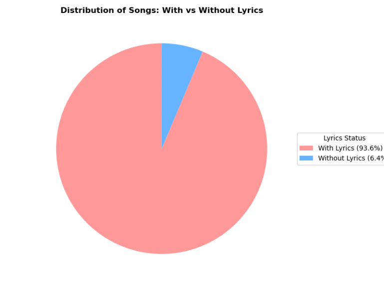

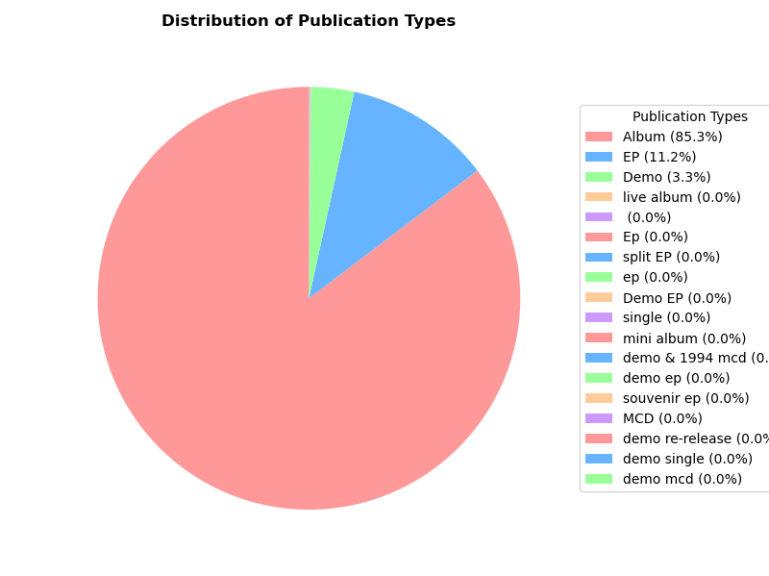

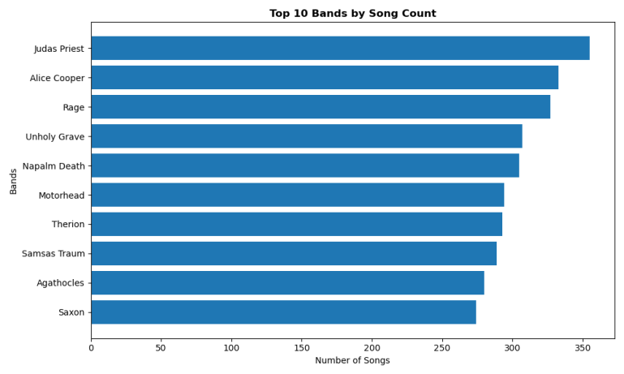

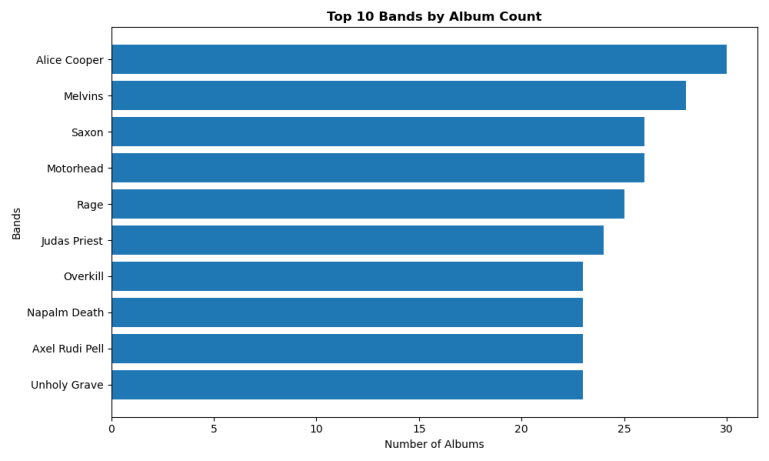

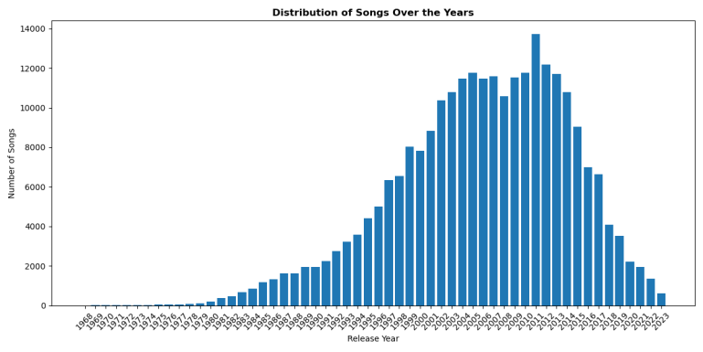

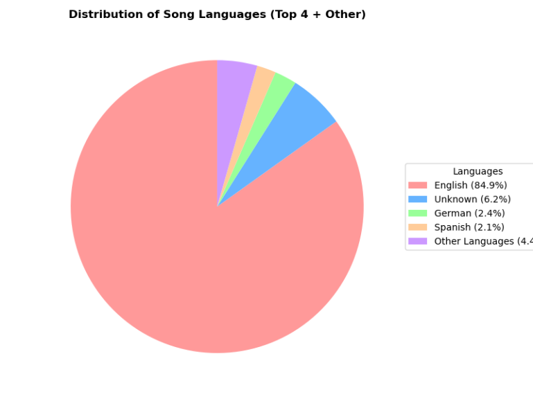

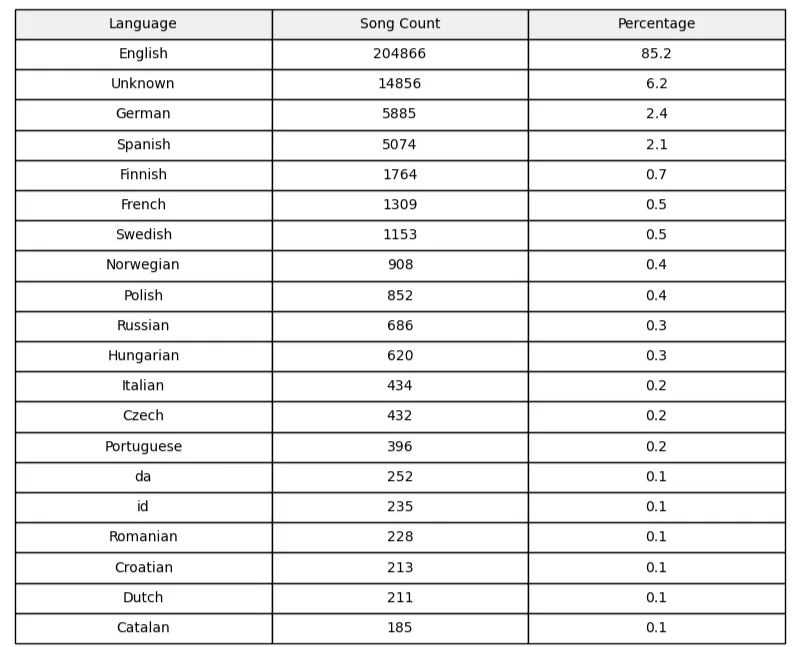

The language distribution is consistent with the Metal world; the dataset does not appear to be biased at first glance.

# II Readability and Lexical Complexity Analysis

This axis focuses on the structural and semantic analysis of lyrics to evaluate their linguistic complexity. We seek to quantify the language level via standardized readability metrics and to study the correlation between profanity (use of swear words) and syntactic simplicity.

## A. Simplified Data Preprocessing

Before any measurement, standardized cleaning is applied to the lyrics via the `_prep_text` function from our script. This process consists of three elementary actions:

1. **Lowercase:** Case uniformization.
2. **Cleaning:** Replacement of line breaks by spaces.
3. **Filtering:** Complete removal of punctuation.

This minimalist treatment allows keeping only raw words to guarantee the reliability of ratio calculations.

## B. Metric Formulation

To characterize the texts, three mathematical indicators were implemented:

### 1. Swear Word Ratio

This ratio measures the proportion of swear words in a song by comparing each word to a reference dictionary (`swear_words_eng.txt`).

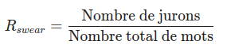

### 2. Coleman–Liau Readability Index

To evaluate complexity, we use the Coleman–Liau Index (CLI). Unlike methods based on syllables, this index uses the number of characters, which is more precise for automated computational processing. It estimates the school level necessary to understand the text (e.g., a score of 12 corresponds to a senior high school level in the USA).

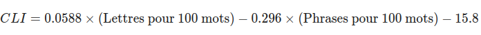

### 3. Proportion of "Simple Songs" (Stupidity Metric)

A song is defined as "simple" (or "stupid" in the context of the study) if its readability index is less than or equal to 3 (elementary school level). We calculate the probability that a song is simple as a function of its profanity rate.

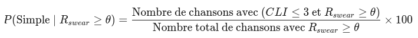

## C. Results and Interpretation

The application of these metrics to our English corpus allows us to identify the following trends.

### 1. Analysis of Extremes by Artist

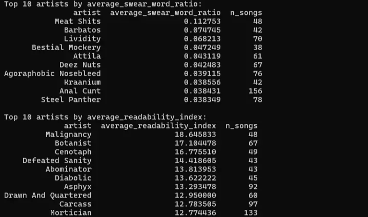

_Rankings of the 10 artists with the highest profanity rate and the highest readability scores_

The analysis of the above tables highlights a clear dichotomy within the genre:

- **Lexical Complexity:** Some groups develop texts of great richness. The group _Malignancy_ reaches an average score of **18.6**, indicating a superior university-level language. Groups like _Botanist_ (17.1) or _Carcass_ (12.7) confirm the existence of a "learned Metal" using technical or dense narrative vocabulary.
- **Profanity Density:** On the opposite end, groups at the top of the profanity ranking, like _Meat Shits_ (11.2% swear words) or _Barbatos_ (7.4%), dedicate a significant part of their lexicon to swear words, which mechanically reduces the space available for complex vocabulary.

### 2. Temporal Evolution

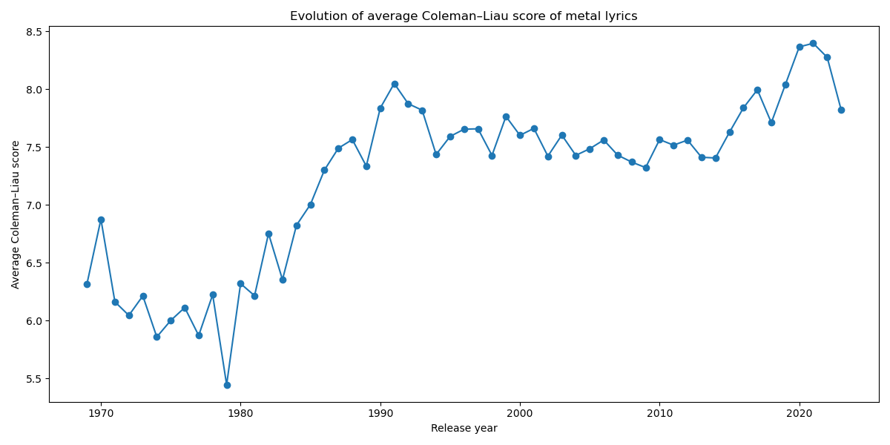

_Evolution of the average Coleman–Liau readability index by year_

The longitudinal analysis of readability reveals a trend toward intellectualization of the genre. Starting from an average index around **6** (middle school level) in the 1970s, text complexity experienced regular growth to stabilize above **8** (high school level) in the 2020s. Metal has therefore not become textually impoverished over time.

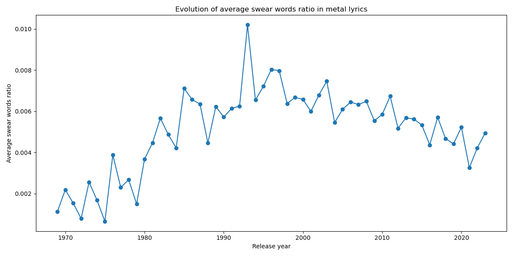

_Evolution of the average profanity ratio by year_

In parallel, the profanity ratio remains globally marginal (below 1% on average). However, we observe high volatility and a notable peak in the early 1990s, a period corresponding to the emergence of more aggressive subgenres (Nu-Metal, influence of Gangsta Rap), before declining.

### 3. Correlation: Profanity vs Complexity

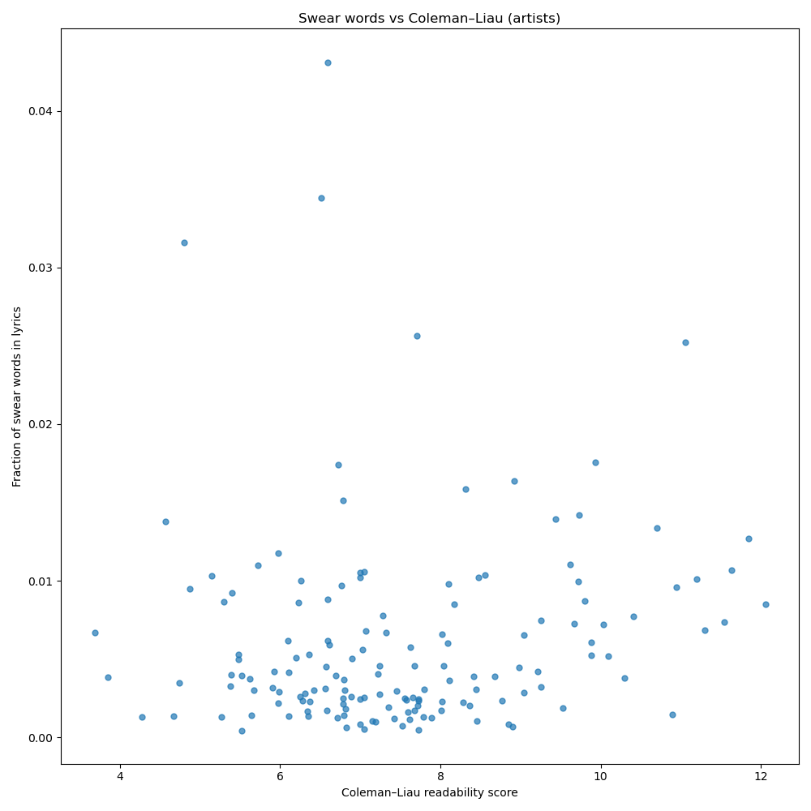

_Scatter plot crossing profanity ratio and readability score by artist_

This graph projects each artist according to their two scores. We observe a massive concentration (the "heart" of the genre) in a zone of low profanity and average readability (score 6-10).
Notable fact: points located highest on the vertical axis (high profanity > 0.03) are almost systematically on the left of the horizontal axis (low readability). This visually suggests that intensive use of swear words is accompanied by syntactic simplification.

### 4. The "Simplicity" Curve

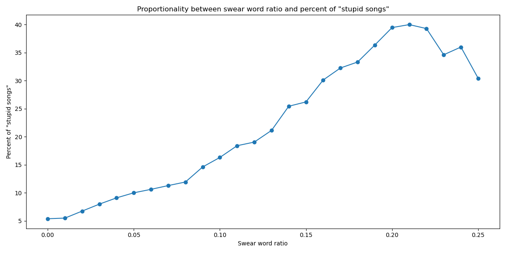

_Proportion of songs considered "simple" as a function of profanity ratio_

To mathematically confirm the previous observation, this curve shows the probability that a song is "simple" (CLI ≤ 3) as a function of its profanity.
The result is clear: the correlation is quasi-linear and positive.

- When the profanity ratio is zero (Rswear≈0), only **5%** of songs are classified as simple.
- When the ratio exceeds 0.20 (20% of the text composed of swear words), this proportion climbs to **40%**.

## 5. **Lexical Frequency Analysis via Word Clouds**

In an exploratory approach to identify predominant themes, we calculated term occurrences in each corpus to generate distinct word clouds. This visualization highlights a striking semantic dichotomy between the two genres.

The word cloud of the **"Non-Metal"** corpus reveals a vocabulary mainly anchored in emotional registers and interpersonal relationships. We observe a clear predominance of verbs and common nouns related to emotions and daily life, with central terms such as "love", "baby", "know", "never", or "time".

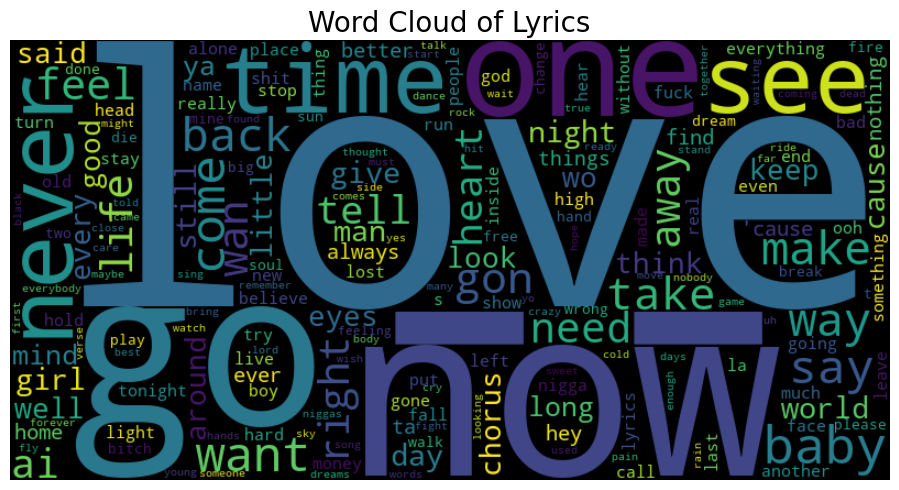

Conversely, the visualization of the **"Metal"** corpus exposes a radically darker and more aggressive lexical field. The most frequent words, which appear here massively, belong to the register of violence, death, and conflict. Terms like "blood", "kill", "death", "war", "fire", and "hell" saturate the visual space, thus confirming the thematic singularity of the Metal genre compared to generalist popular music standards.

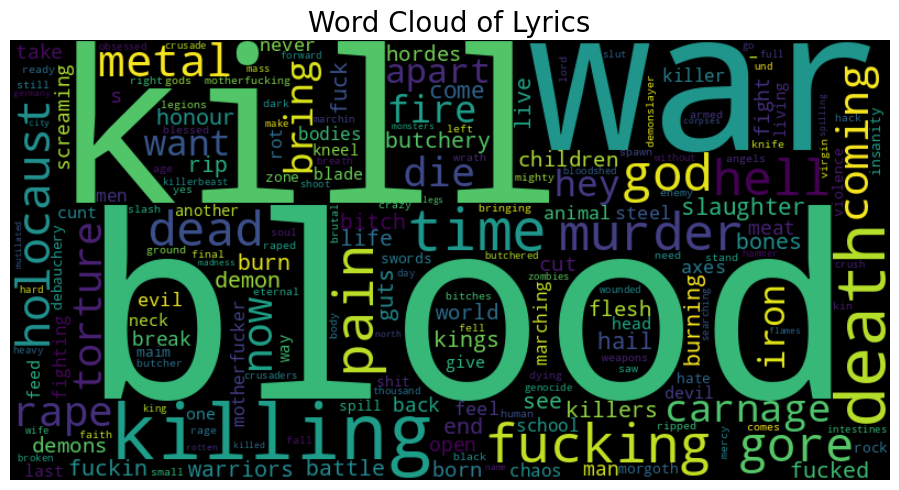

## E. Metalness

### **1. Objective**

By defining _metalness_ (whose principle and formula are greatly inspired by what was done by Lucas Ballore in his medium article, part II), we create a metric allowing us to measure how "metal" a word is: its _metalness_.

### A. Preprocessing and Filtering

Before calculation, two filters are applied to reduce statistical noise:

- **Frequency threshold:** Only words appearing at least **5 times** in each corpus are kept (`v >= 5`). This eliminates words that are too rare and would skew the ratios.
- **Intersection and Length:** Calculation is performed only on words present in **both** corpora (`intersection`) and having more than 2 letters, to exclude linking words that are too short and non-significant.

### B. Mathematical Formulation

The score is calculated in two steps for each word w: calculation of the logarithmic coefficient, then its normalization.

**a. The Metalness Coefficient (Log-Ratio)**
The code first calculates the logarithm of the ratio of raw frequencies between the two corpora. Let fmetal(w) be the frequency of the word in the Metal corpus and fnon_metal(w) its frequency in the Non-Metal corpus:

$$
coeff(w) = ln(\frac{f_{nonmetal}(w)}{f_{metal}(w)})
$$

- If the word is more frequent in Metal, coeff>0.
- If the word is more frequent in Non-Metal, coeff<0.

**b. "Metalness" (Sigmoid Transformation)**
To obtain a readable and bounded score, a **sigmoid** function is applied to the coefficient. This transforms the value (which ranges from −∞ to +∞) into a probability between

$$
Metalness(w) = \frac{1}{1 + e^{-coeff(w)}}
$$

### C. Score Interpretation

If a word's score is:

- Close to 1: The word is strongly characteristic of **Metal**
- Close to 0: The word is strongly characteristic of the **Non-Metal** genre
- Around 0.5: The word is neutral

**The 20 most metal words according to "metalness"**

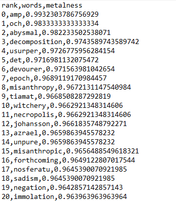

## 7. Metallitude

After the initial results of our previously implemented metalness, we developed a novel metric called Metallitude. Unlike a standard TF-IDF approach applied to a single corpus, our method relies on cross-weighting between the two datasets.

The score is calculated by the product of two distinct components:

1. **Term Frequency (TF)** calculated on the **Metal** corpus, reflecting the importance of a word within the target genre.
2. **Inverse Document Frequency (IDF)** calculated on the **Non-Metal** corpus, measuring the rarity (or banality) of the same word in standard musical language.

This differential approach penalizes words frequent in Metal but also common elsewhere (e.g., "love", "time"), while boosting terms omnipresent in Metal but absent from the reference corpus (to which a maximum IDF score is attributed). The final result is normalized (MinMax Scaling) on a scale from 0 to 1 to facilitate interpretation.

**The 20 most "metal" words according to our metallitude:**

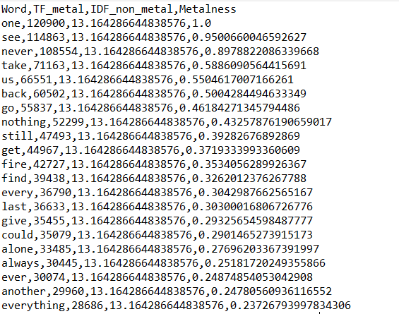

# IV Sentiment Analysis

This axis explores the affective dimension of the Metal genre by applying natural language processing (NLP) methods. The objective is to quantify the emotional polarity of lyrics and observe how these emotions evolve at the scale of a career or an album.

## A. Lexical Happiness Study via the Hedonometer

The measurement of the intrinsic emotional charge of Metal vocabulary relies on a comparative approach using the **Hedonometer**. This is a reference index in psycholinguistics where each word has been evaluated by humans on a "happiness" scale ranging from 1 (sadness/danger) to 9 (joy/safety).

### 1. Calculation Protocol per Song

Unlike VADER which analyzes syntax, the calculation of happiness via the Hedonometer in our project is a purely lexical measure. For each song, the score is calculated according to the following steps:

1. **Extraction and Cleaning:** Lyrics are decomposed into individual words.
2. **Matching:** For each word in the song, the script checks if there is a match in the Hedonometer dictionary.
3. **Lexical Average:** The happiness score of the song H_song is the average of the happiness scores of all identified words:

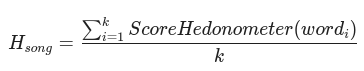

### 2. Analysis of Lexical Extremes

The application of this index to our corpus allows us to identify two opposing linguistic poles:

- **The Positivity Pole:**
  Terms related to laughter (_laughter_, _happiness_) or affection (_love_, _joy_) dominate with scores above **8.0**. Although present, they are a minority in pure Metal lexicon.
- **The Negative Saturation Pole:**
  Vocabulary identified as "very Metal" collapses into the lowest scores of the dataset: _suicide_ (1.30), _murder_ (1.48), _death_ (1.54), and _torture_ (1.58).

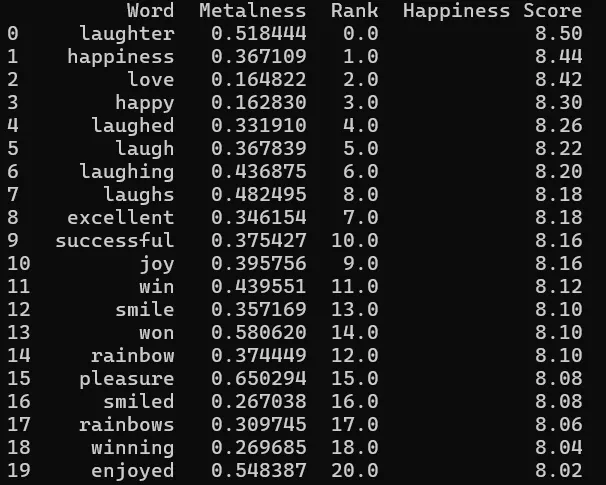

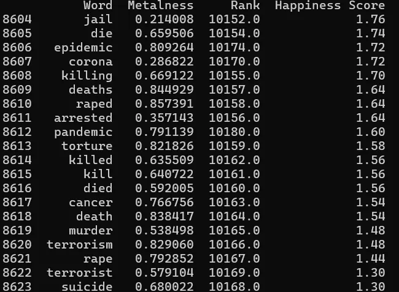

## B. Methodology and Dynamic Analysis (VADER)

To evaluate songs contextually, we use the **VADER** algorithm (_Valence Aware Dictionary and sEntiment Reasoner_).

### 1. Detailed Algorithm Functioning

The code transforms lyrics into a final score via three nested levels of analysis:

- **Word Level (The Lexicon):** VADER consults a dictionary of 7,500 terms rated from -4 to +4. It adjusts the score according to emphasis: a word in **CAPITALS** or followed by **exclamation marks** sees its valence increased.
- **Sentence Level (The Syntax):** The algorithm calculates a _Compound_ score by integrating "booster words" (e.g., _"extremely dark"_) that intensify sentiment and inversions (e.g., _"not dead"_) that flip polarity.
- **Song Level (Aggregation):** Our script performs an arithmetic average of all sentence scores of the song:

  S_song = (1/n) \* Σ(i=1 to n) Compound(s_i)

### 2. Histogram Analysis and Saturation Theory

The histogram reveals a massive concentration of songs at the extreme left (**-1.0**). A technical analysis allows us to interpret this result:

- **Exclusion of Punctuation Error:** One might assume that a lack of punctuation would prevent sentence segmentation and skew the calculation. However, our script's `tokenize.sent_tokenize` works on raw text preserving original structures. Moreover, even without punctuation, VADER treats the block as a unique sentence and applies its valence rules reliably.
- **Lexical Saturation Theory:** The real reason for this peak is mathematical. VADER uses a normalization that saturates very quickly toward extremes. In Metal, the density of words with strong negative valence identified in the Hedonometer study (_Death, Kill, Pain_) is so high within a single track that the final score is irremediably pushed toward **-1.0** without any positive words coming to counterbalance.

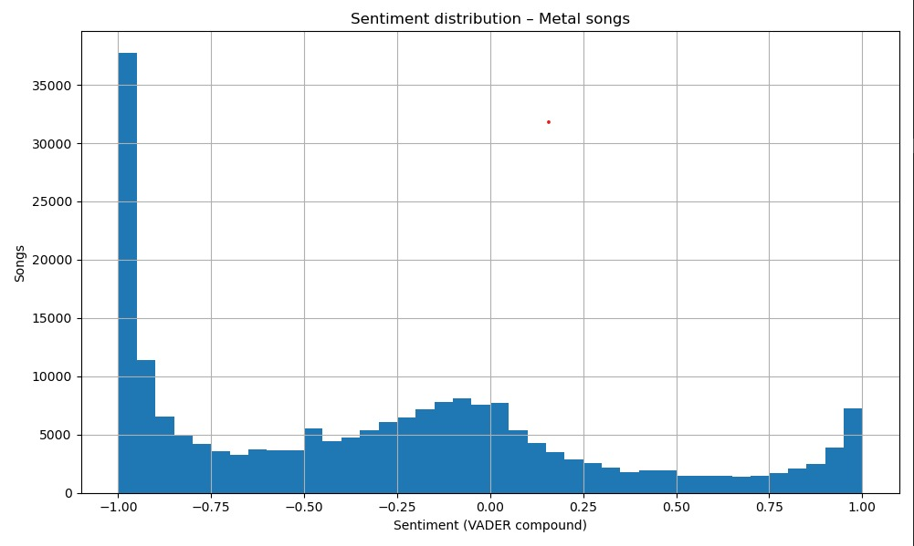

## C. Case Studies and Correlations

### 1. Emotional Topology (Top Songs)

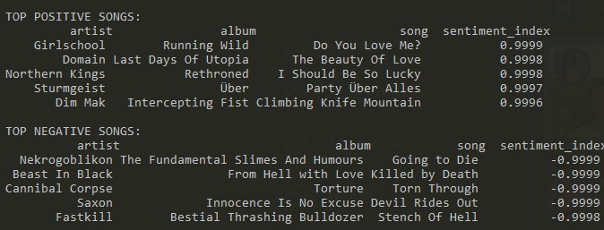

Negative songs (_Going to Die_) reach **-0.9999**, while positive titles (_Do You Love Me?_) saturate at **+0.9999**, validating the pipeline's sensitivity to lexical extremes.

### 2. Opeth's Emotional Dynamics

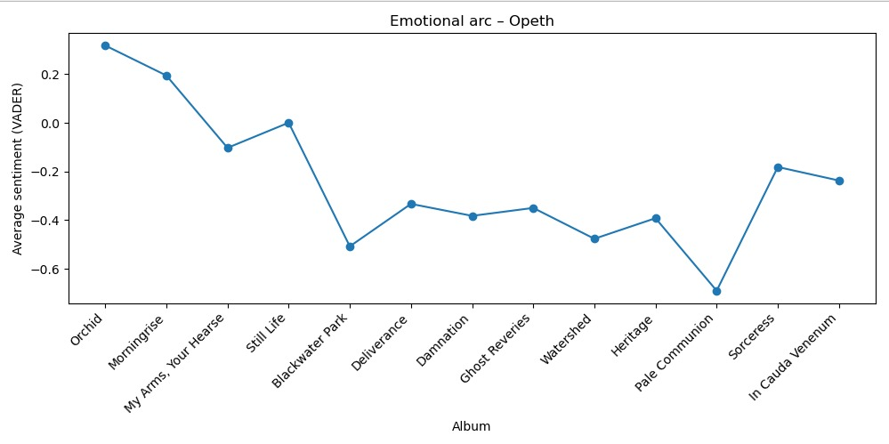

The arc shows a fall toward melancholy: founding albums (_Orchid_) are more "positive" (0.3) than recent productions like _Pale Communion_ (-0.7).
Opeth's _Sentiment Path_ illustrates their stylistic versatility: while their _Metalness_ remains globally high, their emotional charge varies strongly from one album to another.

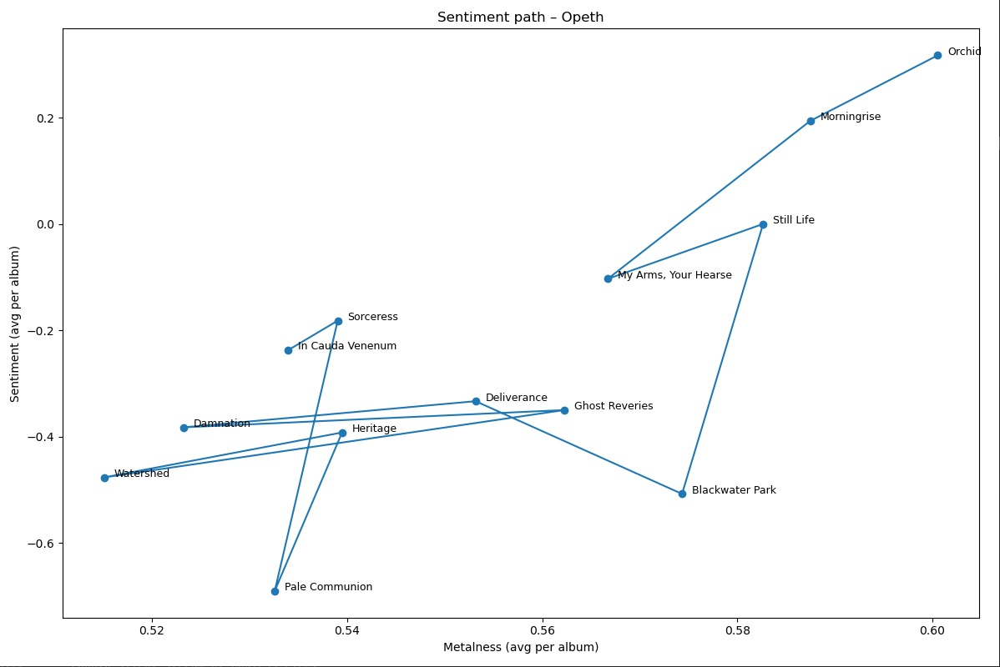

### 3. Metalness vs Sentiment

The scatter plot confirms the inverse correlation: the more the words used are characteristic of the genre (high _Metalness_ score), the more the average sentiment tends toward negativity.

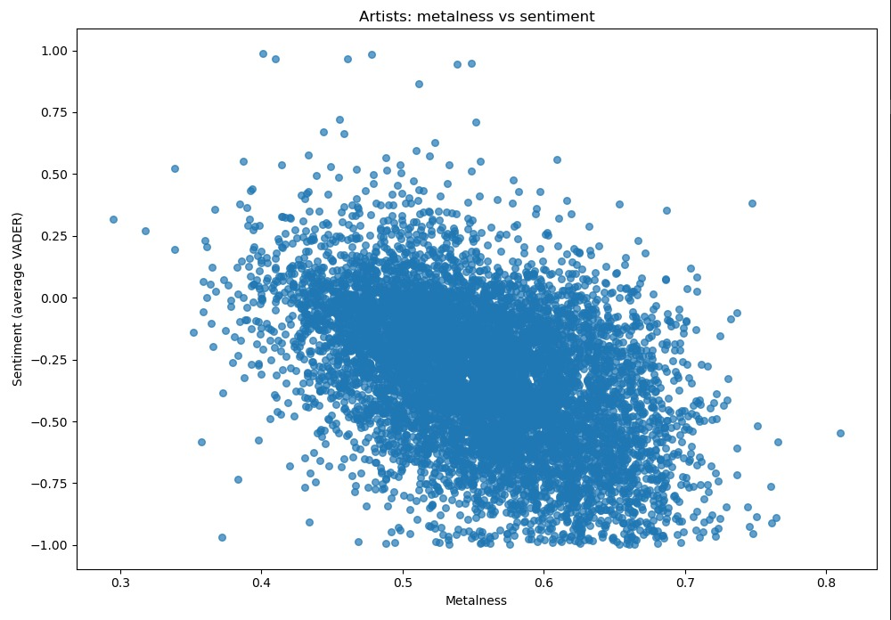

# V Exploratory Approaches

## A. Clustering of the 50 Bands with the Most Albums According to "Metallitude"

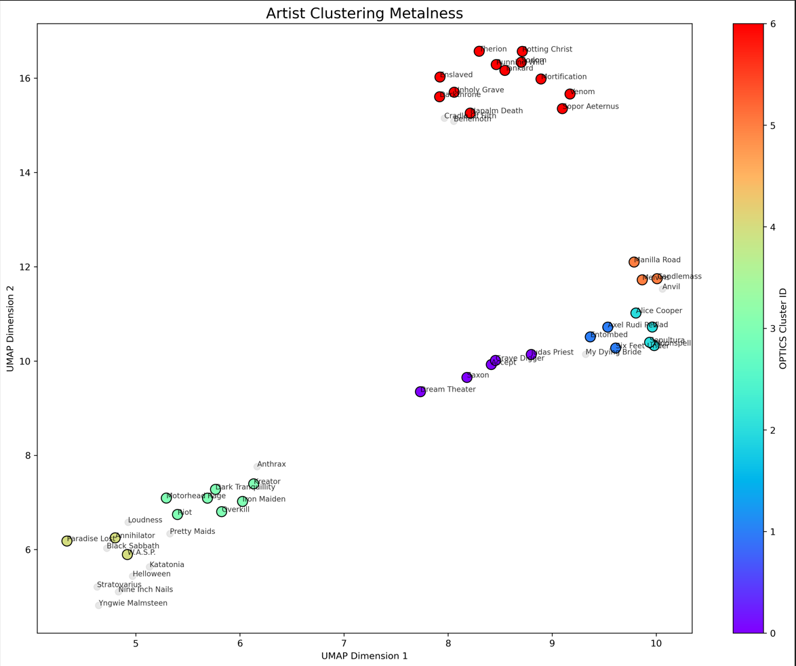

In this section, we calculated the average **metallitude** per band and applied density clustering (OPTICS). Then, we visualized our results by projecting into a 2D space with UMAP.

Visualizing results via this projection highlights coherent groupings but raises an important limitation in terms of graphical representation.

**Visualization Critiques:**

The use of UMAP here proves superfluous, even counter-intuitive. By projecting one-dimensional data (the Metalness score) into a 2D plane, the algorithm creates a "snake"-shaped structure that does not provide additional structural information. With more time, a **distribution histogram** would have allowed directly reading the score thresholds separating groups without the spatial distortion induced by dimension reduction.

**Cluster Interpretation and Validation:**

Despite the methodological reservations mentioned about visualization, it turns out that this clustering based solely on **Metallitude** produced the most coherent results of our study. The separation of groups is so clear that it allowed us to assign a dominant genre label to each cluster.

**Label Attribution Method:**

Automatic cluster labeling relies on a **majority voting** system applied to genre metadata extracted from Encyclopaedia Metallum. For each cluster identified by OPTICS, we:

1. Collected genres associated with each artist in the cluster from the `bands_genres_cleaned.json` file (from Metal Archives scraping).
2. Counted occurrences of each genre within the cluster using a frequency counter.
3. Assigned to the cluster the label corresponding to the two most frequent genres, separated by " / ".

This approach enables automatic classification without manual annotation, exploiting external metadata to validate the semantic coherence of groupings obtained by clustering.

As illustrated in the annotated figure below, this approach enables relevant automatic classification: clusters naturally polarize between "extreme" genres (Death/Thrash) characterized by high _Metalness_, and "melodic" genres (Power/Heavy) with more moderate scores.

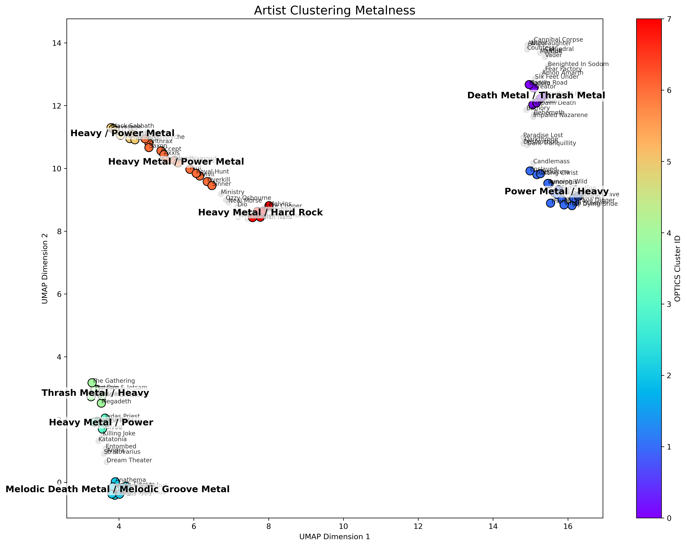

## 2. Clustering of Albums According to Their Average "Metalness" Score

In an exploratory approach, we attempted to segment albums by performing clustering based on their average **metalness** score.

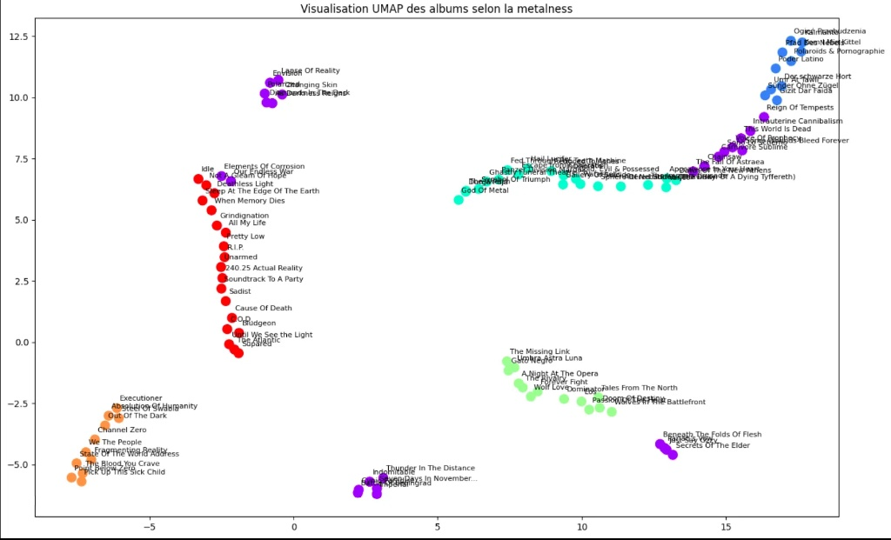

To visually interpret this distribution, we projected the results into a two-dimensional space via the UMAP algorithm. Although the graph shows distinct groupings (colored clusters), a critical review conducted with the teaching team highlighted a fundamental methodological inconsistency in this approach.

Indeed, we attempted to project intrinsically one-dimensional data (the scalar metalness score) into a 2D space. This operation is logically redundant: clustering on a single variable amounts to defining thresholds on a line, and using UMAP here artificially complicates the information without real analytical gain. This step was therefore not retained for the final analysis, but it constituted an important learning point on the necessity of using multivariate input data to justify the use of dimension reduction algorithms.

## 3. Clustering of Top 50 Artists According to Metallitude/Profanity/Readability

In this section, we applied the OPTICS algorithm to the 50 bands with the most albums, using a three-dimensional vector space composed of **Metalness**, **Readability**, and **Swear Word Ratio**. The UMAP projection of this clustering reveals a striking semantic polarization that validates the relevance of our metrics.

The space organizes according to a clear horizontal gradient:

- **On the left (Red/orange cluster):** We find the pillars of **Extreme Metal** (Death, Black, Grindcore) such as _Napalm Death_, _Behemoth_, _Darkthrone_, or _Cradle of Filth_. This grouping is explained by heavy use of violent vocabulary (high Metalness) and a high profanity rate, intrinsic characteristics of these subgenres.
- **On the right (Purple/blue cluster):** Conversely, clustering isolates **Power Metal** and traditional **Heavy Metal** groups like _Iron Maiden_, _Helloween_, _Stratovarius_, or _Yngwie Malmsteen_. These bands, although "Metal", use vocabulary often more lyrical, fantastical, or epic, resulting in different Metalness and quasi-absence of profanity, which mathematically distances them from the first group.
- **In the center (Gray points):** Unclassified artists (noise/outliers) like _Judas Priest_, _Dream Theater_, or _Alice Cooper_ occupy an intermediate position, suggesting a lexical balance that does not saturate any of the three observed metrics.

In conclusion, the combination of profanity, text complexity, and "metallitude" is sufficient to recreate the fundamental distinction between "melodic" metal and "extreme" metal.

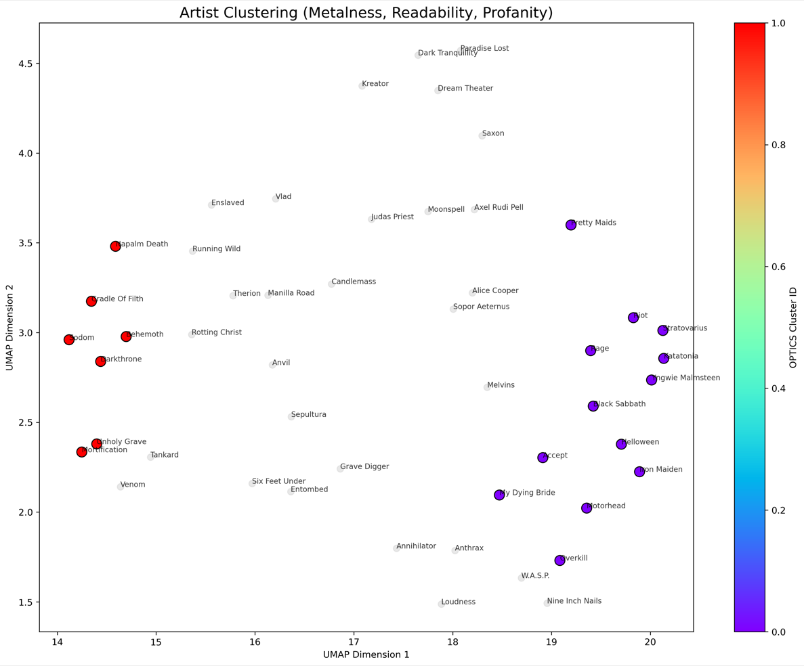

## D. Clustering of the 50 Artists with the Most Albums According to Metallitude/Happiness

**Definition of Happiness:**

To quantify the affective tone of lyrics, we relied on the emotional valence dictionary developed by the **Hedonometer** project. This lexical resource is based on a composite list of the 10,000 most frequent words in English, extracted from various sources (Google Books, New York Times, Twitter, and song lyrics).

The particularity of this lexicon lies in its annotation method: each word was evaluated via a _crowdsourcing_ campaign (Amazon Mechanical Turk), where human annotators attributed a feeling score on a scale from **1 (sad)** to **9 (happy)**.

In the context of our study, the "Happiness" of a text is calculated by taking the average of valence scores of words present in the lyrics, allowing each album to be positioned on an axis ranging from emotional distress to euphoria.

**Clustering:**

By crossing our lexical specificity metric (**Metallitude**) with emotional valence analysis (**Happiness**), clustering reveals an even more marked polarization than previously. The UMAP projection draws a quasi-linear diagonal trajectory suggesting a **strong inverse correlation**: the more a group uses vocabulary specific to metal, the more negative the emotional tone of its texts.

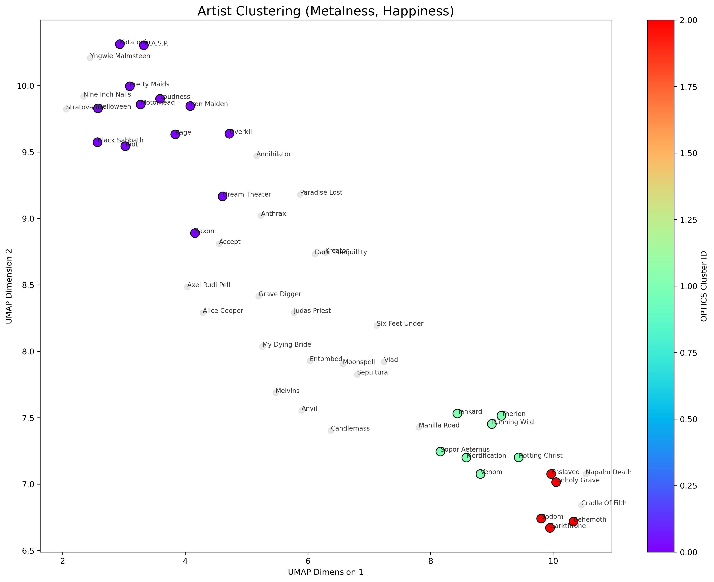

This analysis distinctly separates two worlds:

- **The Epic and Positive Pole (Purple cluster - Top Left):** We find figures of Power Metal and melodic Heavy Metal like _Helloween_, _Stratovarius_, _Yngwie Malmsteen_, or _Iron Maiden_. Their position indicates texts less saturated with exclusive "metal" vocabulary and higher emotional valence (more "joyful" or heroic).
- **The Dark and Extreme Pole (Red cluster - Bottom Right):** Conversely, Death and Black Metal groups like _Napalm Death_, _Behemoth_, _Darkthrone_, or _Sodom_ are isolated in a zone of "minimal happiness" and "maximum metallitude".

This graph confirms a structural hypothesis of the genre:

The lexical identity of extreme metal is intrinsically built on negativity and emotional distress, where traditional metal retains a part of lexical positivity.

## **E. Clustering of Artists and Albums with TF-IDF**

### 1. Principle

We also classified artists and albums (scripts `artists_tf_idf.py` and `albums_tf_idf.py`) via the TF-IDF method (already used previously to calculate metallitude), thus without using already computed metrics.

Unlike metallitude, we apply TF-IDF here only on corpora containing lyrics of metal songs (English only), since we want to reveal the subgenres of metal artists/albums.

To do this, after grouping the data by artist or by album, we apply TF-IDF by calculating IDF on the entire metal dataset lyrics and TF on the lyrics of the artists or albums we want to classify. We thus obtain a very large matrix, with artists or albums in rows and text units (words) in columns.

We then apply clustering on the TF-IDF matrix with OPTICS or KMeans:

- **OPTICS:** Density clustering, determines the number of clusters by itself.
- **KMeans:** Nearest neighbors method, requires fixing the desired number of clusters in advance. To address this limitation, we choose the number of clusters by cross-validation on the silhouette score of the clustering.

Finally, we use UMAP to project the data onto 2 dimensions and thus visualize them.

**Note:** Since clustering occurs on the TF-IDF matrix directly, i.e., before projecting the data into 2D, it is possible that some artists or albums have a label that does not correspond to their neighbors in the UMAP visualization.

### 2. Clustering on Artists

We chose to classify the 100 artists with the most songs in our metal dataset.

- **With OPTICS:**

OPTICS does not give interesting results in this case; it fails to find clusters and thus leaves the vast majority of data unclassified (cluster -1 or noise).

We can obtain several clusters by lowering the `min_samples` parameter to 2 (the minimum number of points to create a cluster), which was initially set to 5, but we then only obtain clusters of 2 to 4 artists, which is not very relevant, and the vast majority of artists remain associated with noise:

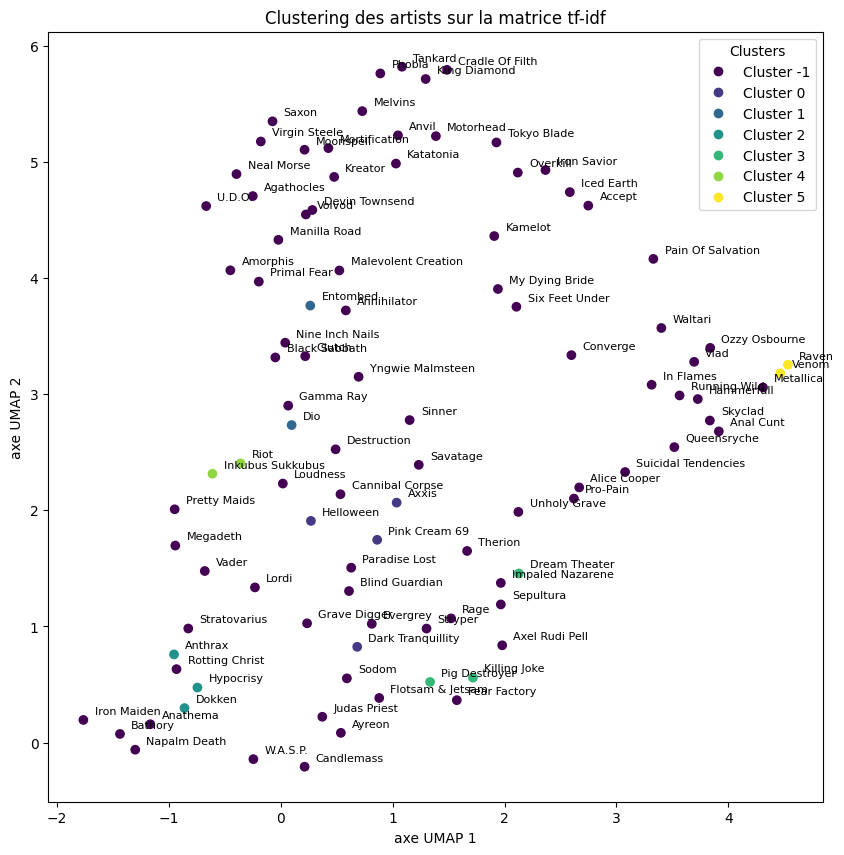

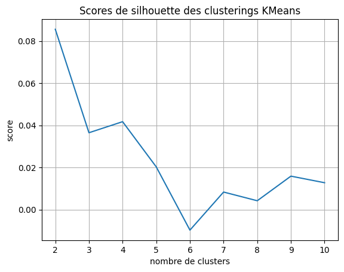

- **With KMeans:**

We perform cross-validation of the number of clusters (the `n_clusters` parameter of the `sklearn` function) over the range of values from 3 to 10, because artists not being separated into distinct groups, including `n_clusters = 2` in the cross-validation would systematically choose 2 clusters, where one of the two clusters encompasses almost all artists.

Silhouette scores with 2 in the cross-validation range:

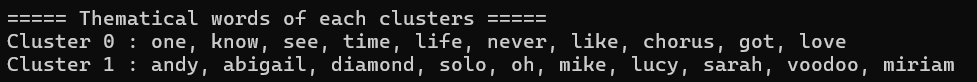

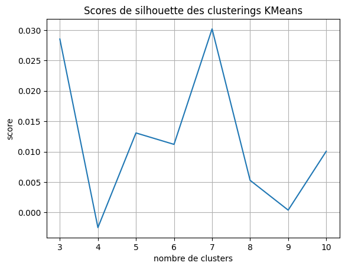

With almost all artists classified in cluster 0.

Here are 2 examples of what we can obtain by removing 2 from the values tested for the number of clusters.

**===== Execution 1 =====**

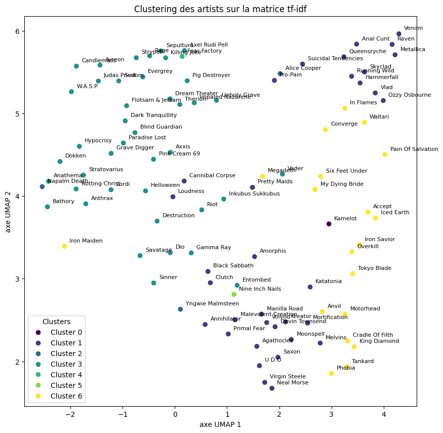

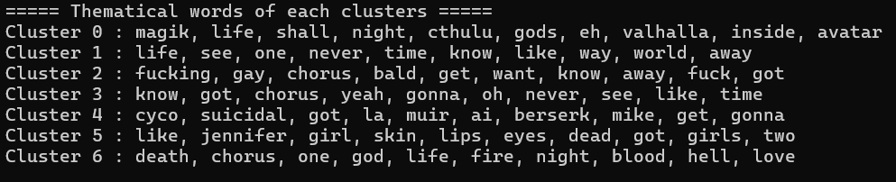

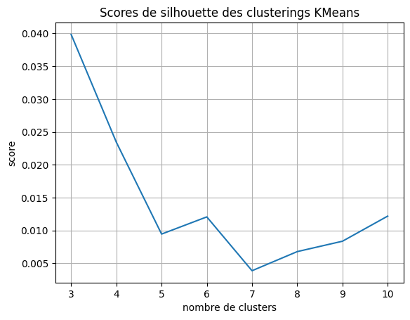

**===== Execution 2 =====**

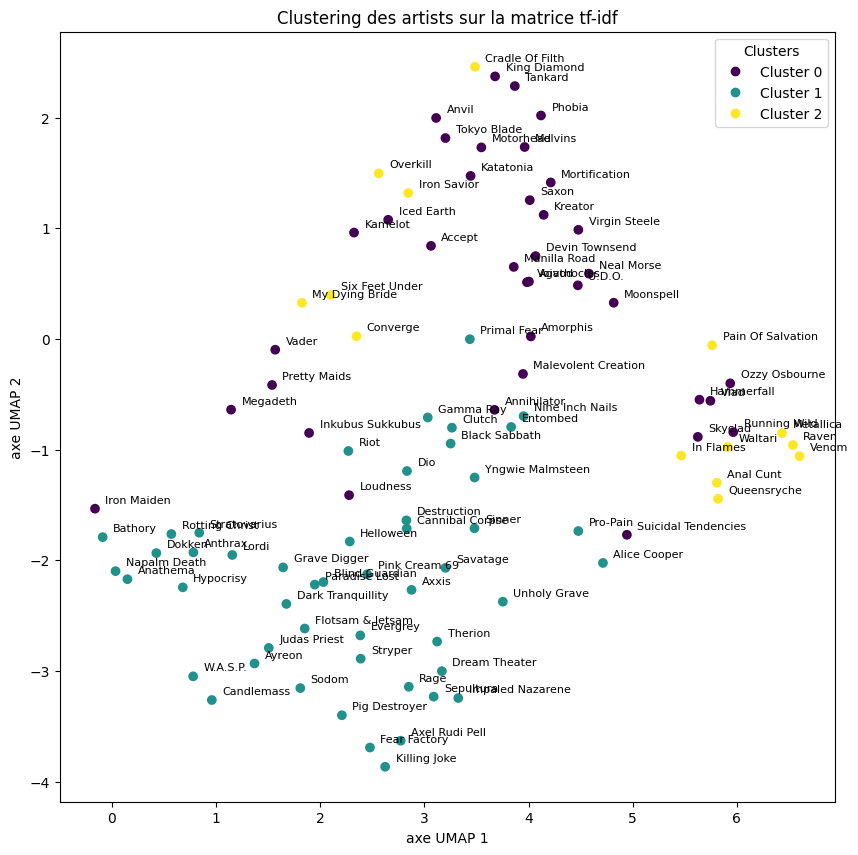

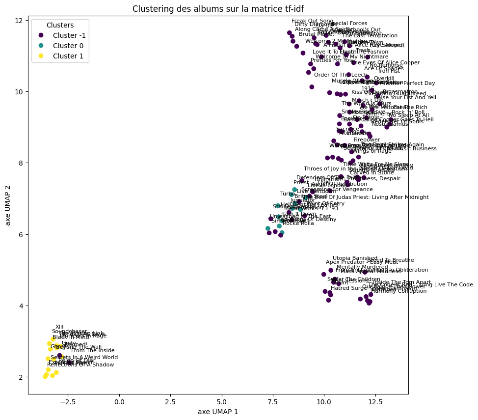

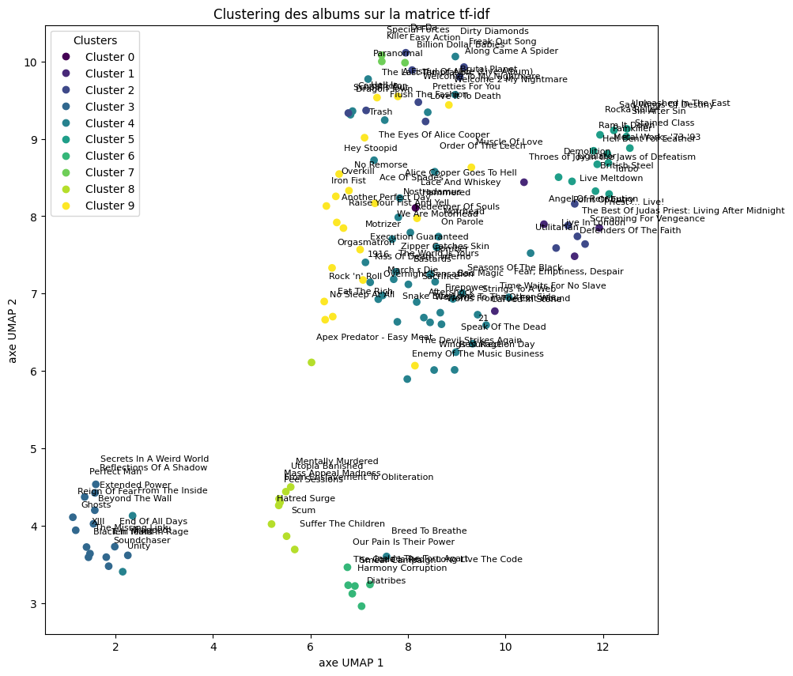

### 3. Clustering on Albums

We chose to take the albums of the 5 artists with the most songs, which gives 128 albums. The artists are: Judas Priest, Alice Cooper, Rage, Motorhead, and Napalm Death.

- **With OPTICS:**

We encounter the same problem with OPTICS as with artist clustering, even though we observe on albums a clearer separation of the data with groups well separated from the mass, but the mass remains associated with noise, as well as some groups of points that are easily identifiable in the visualization.

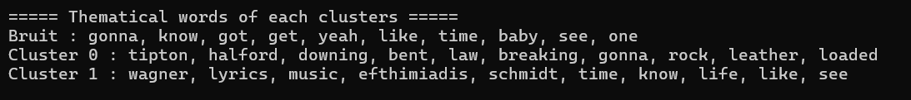

- **With KMeans:**

Same cross-validation principle as with artists, but no need to remove 2 from the tested values this time, and we extend the range up to 15:

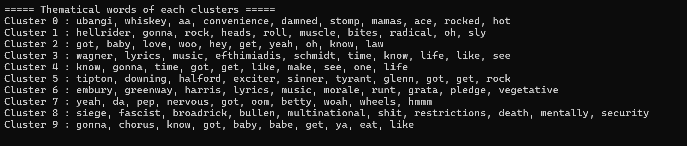

This time, the labels assigned by KMeans correspond more coherently to the 2D visualization.

# VI Conclusion

The **PAO Metal Mining** project validated the contribution of Data Science and Natural Language Processing (NLP) techniques for large-scale musicological analysis. By structuring a complete pipeline, from distributed collection of thousands of titles to multivariate analysis, we were able to objectify the stylistic characteristics of a genre often reduced to stereotypes.

**Methodological Lessons**

Beyond musical results, this project constituted a methodological learning laboratory. The critique of our own visualizations (notably the inappropriate use of UMAP on one-dimensional data) highlighted the importance of adequacy between data nature and projection algorithms.

Conversely, the success of multivariate clustering (Metalness/Readability/Profanity) confirms that a metal band's identity can be predicted with high reliability solely from its texts, without any audio signal analysis.

# VI Sources

[When heavy metal meets data science | Episode I](https://blog.lucaballore.com/when-heavy-metal-meets-data-science-2e840897922e)

[When heavy metal meets data science | Episode II](https://blog.lucaballore.com/when-heavy-metal-meets-data-science-3fc32e9096fa)

[When heavy metal meets data science | Episode III](https://blog.lucaballore.com/when-heavy-metal-meets-data-science-episode-iii-9f6e4772847e)

[GitHub - lballore/deep-metal: NLP analysis on heavy metal lyrics and NN-based lyrics generator](https://github.com/lballore/deep-metal)

[The Hedonometer](https://hedonometer.org/words/labMT-en-v2/)

[Home - Encyclopaedia Metallum: The Metal Archives](https://www.metal-archives.com/)
